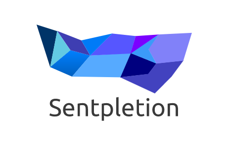

# Sentpletion
Sentpletion is a desktop application for Windows, Mac, and Linux operating systems that helps to organize and facilitate sentence completion exercises. Sentence completion is a technique used in clinical psychology to promote personal growth by learning our individual patterns of cognition. You start with a pre-define sentence stem and complete it quickly. The goal is to complete a sentence with little thought in order to understand your underlying 'scripts' or assumptions that you subconsciously believe. Even when you are entirely stumped, the point of sentence completion is to keep writing. You then reflect on your sentences to understand yourself. See [Nathaniel Branden's webpage](http://www.nathanielbranden.com/sentence-completion-i) for more on sentence completion.

### Example
Each week you have the same 5-6 sentence stems. In under 10 minutes you must add 6-10 completions for each stem. Then you file these sentences away because you are not supposed to read any sentences from that week. Only at the end of each week can you pull up the sentences and re-read them in reflection for personal growth.

| Stem | Completion |
| --- | --- |
| *If I listen more to what people tell me today...* | I will understand that others want to help me grow. |

## The Problem
I have used sentence completion for several months now in a simple [Evernote](https://evernote.com/) page or journaled in my notebook. I found, however, that there was no good platform to do sentence completion: in Evernote (or any text file for that matter) I found it difficult to manage each day and week of sentence completion and I could not hide my previous sentences. My written journal was too repetitive and took up too much paper and space. Overall, it was difficult to track, manage, and took too much space.

## My solution
Sentpletion is my solution to the organizational and management problems of sentence completion exercises. The desktop app offers an initial month of sentence completion stems to get users started. Each month users will be notified of a new month's worth of sentence stems. Users can also edit these stems or add their own. After a user enters a sentence completion to a stem, the app logs that stem and only reveals all completed sentences at the end of each week. The screen will only show you 1 sentence stem at a time with the ability to include between 2-10 stem completions. You set the number of stems you want between 2 and 10. For example, say you set 6 stem completions, once you input 6 completions to a stem, the next stem appears. Therefore, Sentpletion also offers an aesthetically minimal interface so that users can focus on the exercises themselves over the interface.

### Keeping you On Track
The entire point of sentence completion is to restrict yourself a bit so that you write what initially springs to mind. Otherwise, you over-analyse your sentences during writing and fail to identify how you act and what you tell yourself. 

To keep you on track, I implement the following:

- Each week is counted by 7 days of full sentence completion. Therefore, if you miss several days in a week, you must complete the full 7 days of exercises before moving onto the next week of exercises.
- The app will notify you if you have not completed your daily exercises after 10 minutes. It will then notify you every consecutive 5 minutes. (This feature can be switched off)
- You cannot set less than 2 or more than 10 sentences to complete for each stem
- You can set the app to notify you at a specific time each day to complete your exercises

### Security
Sentence completion inevitably involves writing personal issues or information that you never want the world to see. You may not feel comfortable logging your personal feelings and struggles away in a server database. **Worry not!** The solution: all sentences are stored locally in your computer. Nothing you write is stored in a server. You can also choose to clear your sentences at any time. Sentpletion **is not** a web application and there are no usernames/passwords - the information you put into it is entirely local to your computer.
